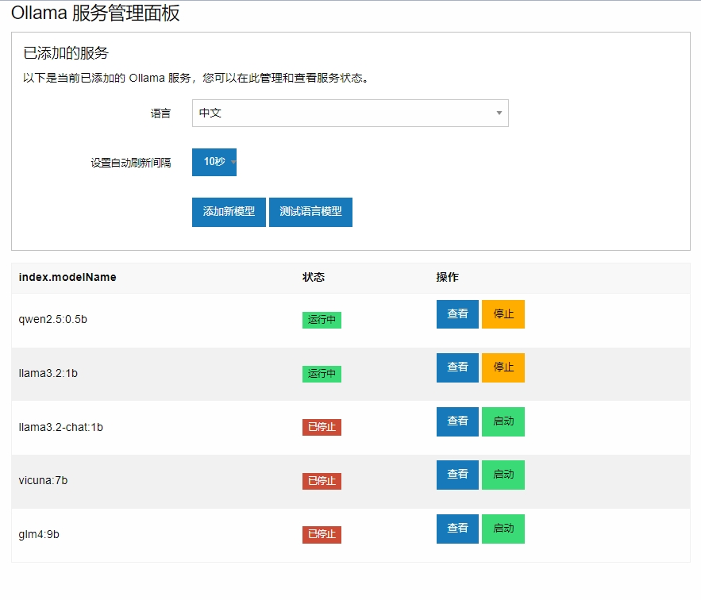
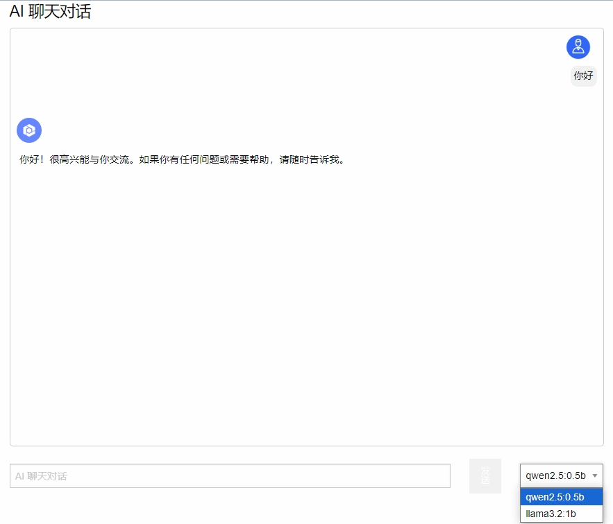
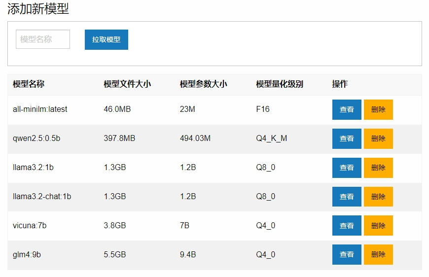
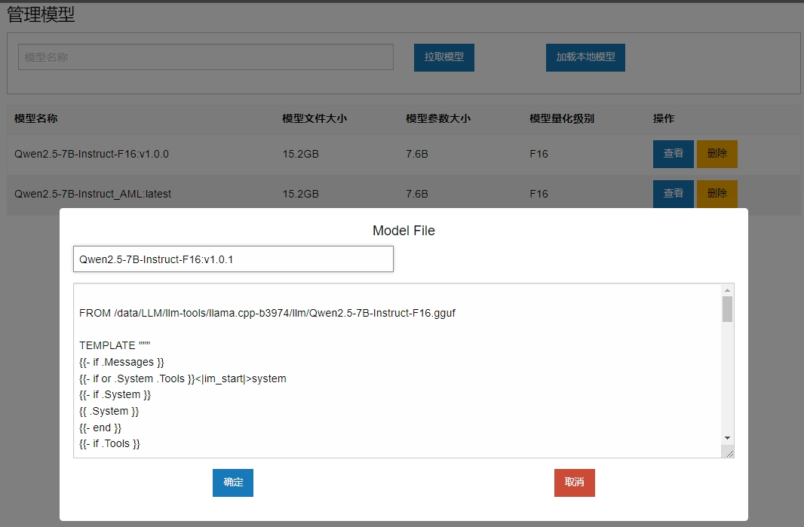

# 一个简易的Web管理页面

[中文](README.md) | [English](README_en.md)

## 安装

```bash
pip install -r requirements.txt
```

## 配置

### 配置服务端地址

在 `config.py` 中

### 配置Web前端

在 `ajax.js` 中

## 运行

``` bash
python main.py
```

### 管理页面



### AI 聊天页面



### 添加新模型



### 从本地添加模型

