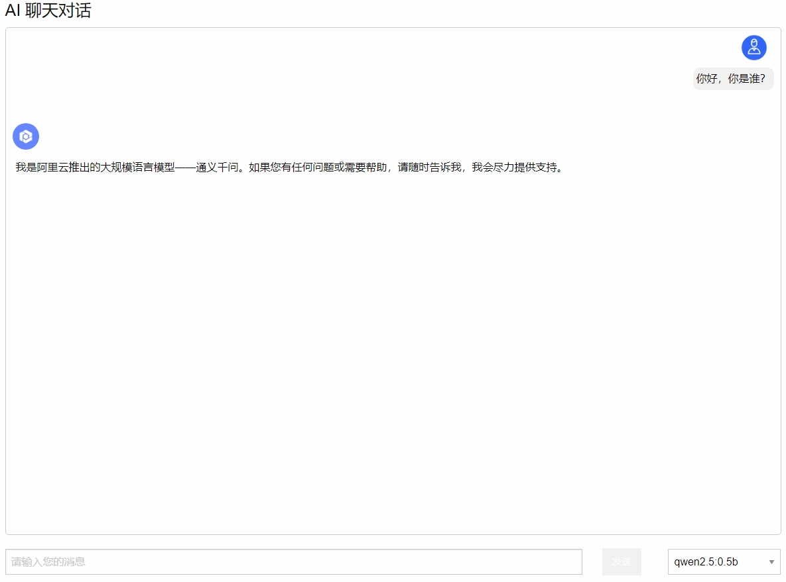

# 一个简易的Web管理页面

## 安装

``` bash
cd backend

pip install -r requirements.txt

```

## 配置

### 配置服务端地址

在 `config.py` 中

### 配置Web前端

在 `ajax.js` 中

## 运行

``` bash
cd backend

python main.py
```

### 管理页面


### AI 聊天页面

