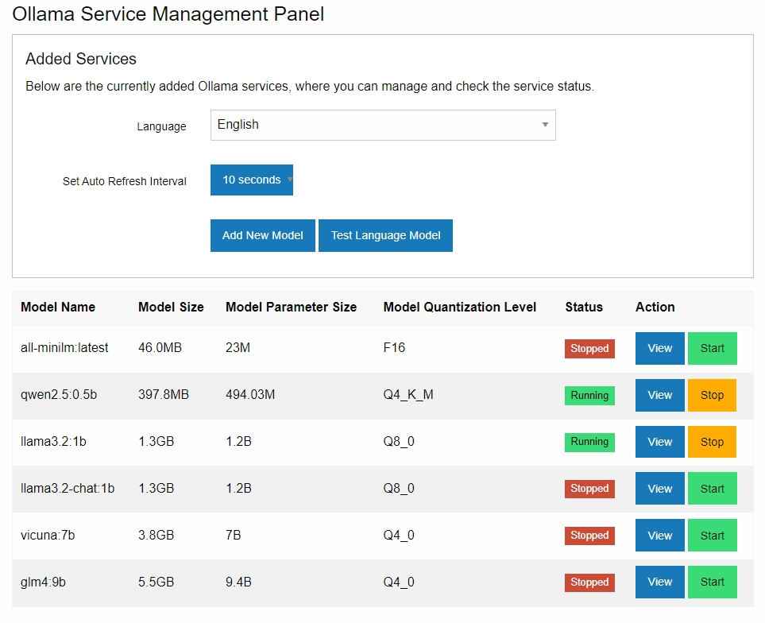
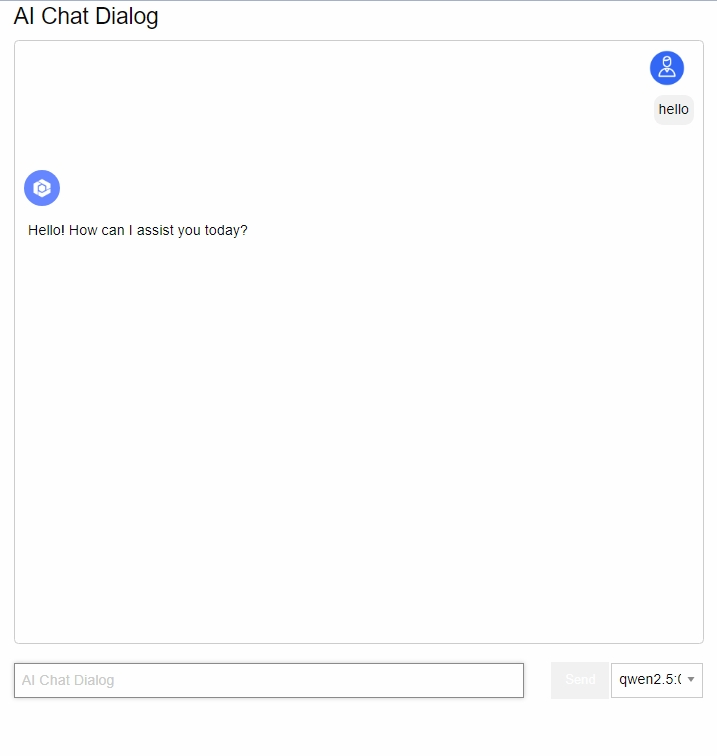
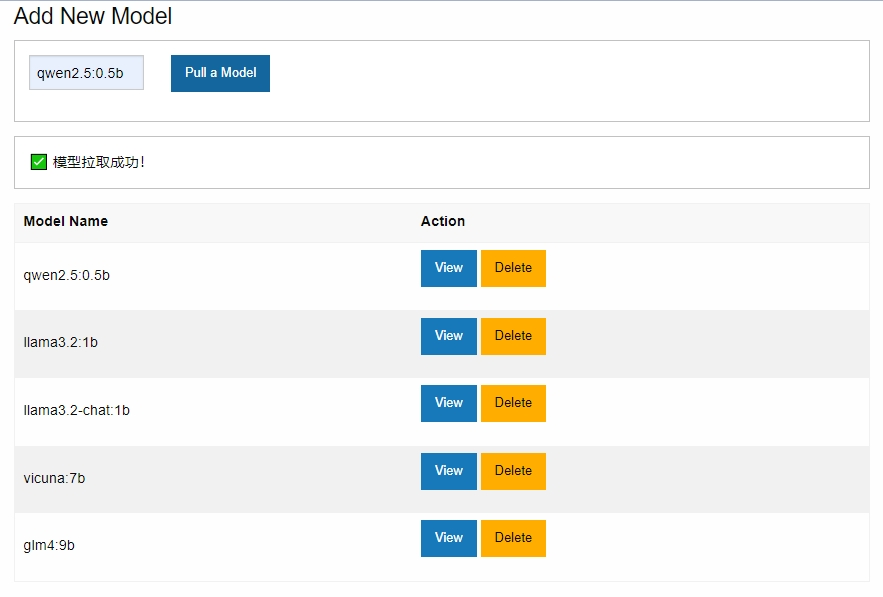

# A Simple Web Management Page

[中文](README.md) | [English](README_en.md)

## Installation

```bash
pip install -r requirements.txt
```

## Configuration

### Configure Server Address

In `config.py`

### Configure Web Frontend

In `ajax.js`

## Running

```bash
python main.py
```

### Management Page



### AI Chat Page



### Add New Model



### Load Local Model

